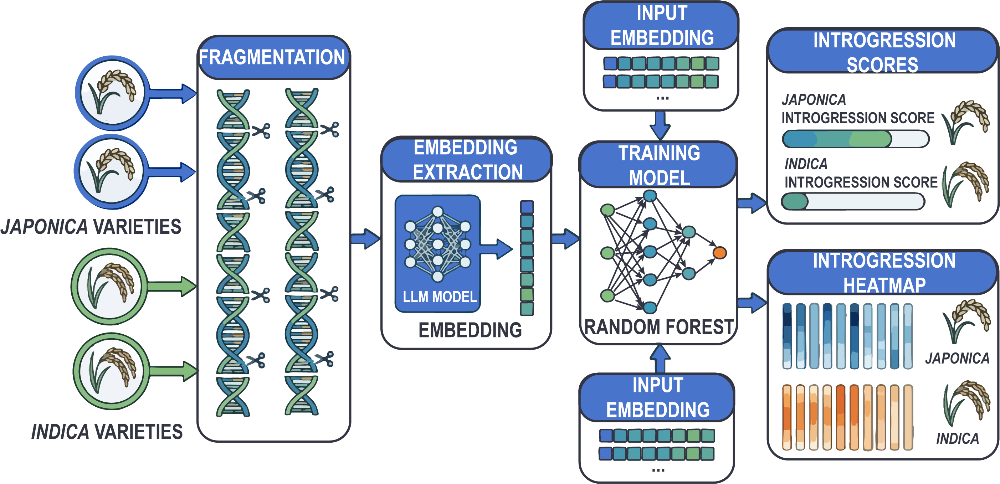

# **ScenarioⅠ: Identification of *indica-japonica* Introgression**

## **1.Task Description**

This case aims to exploit the capacity of the OGR foundation model for fine-scale inference of subspecies origin across the rice genome, enabling the identification of introgression between *indica* (*Oryza sativa* subsp. *indica*) and *japonica* (*Oryza sativa* subsp. *japonica*). Unlike traditional approaches that rely on SNP-based statistics or local sequence alignment, this study starts directly from raw genomic sequences. High-dimensional embeddings are extracted using the OGR model, upon which downstream predictive models are built. This approach enables the capture of deep genetic structural differences at the sequence level, facilitating the identification of potential introgressed regions between subspecies.

## **2.Data Source and Processing**

This study utilizes high-quality, well-annotated assembled rice genomes with clearly defined origins, including:

Data foundation: a collection of high-quality assembled rice genomes

Subpopulation assignment: based on subpopulation labels from the RiceVarMap database

Sample selection: samples overlapping with the 3KRGP (3K rice genome project) were selected, followed by further filtering using whole-genome variation–based principal component analysis (PCA). Finally, 10 representative samples were selected from both *indica* and temperate *japonica* groups, aiming to preserve within-subpopulation genetic diversity while minimizing potential interference from introgression introduced during breeding history. And one additional representative sample from each of *indica* and *japonica* was selected to construct an independent test set for evaluation.

| Sample Name     | ID_3K          | Region      | Subpop                | Set          | DOI                        |
| --------------- | -------------- | ----------- | --------------------- | ------------ | -------------------------- |
| Aimakang        | B115           | China       | *Indica* I          | Training Set | 10.1038/s41588-025-02365-1 |
| Lucaihao        | B208           | China       | *Indica* I          | Training Set | 10.1038/s41588-025-02365-1 |
| Nantehao        | B062           | China       | *Indica* I          | Training Set | 10.1038/s41588-025-02365-1 |
| Gang_46B        | CX10           | China       | *Indica* I          | Training Set | 10.1101/gr.276015.121      |
| Guangluai_4     | B061           | China       | *Indica* I          | Training Set | 10.1101/gr.276015.121      |
| TAICHUNGNATIVE1 | CX270          | China       | *Indica* I          | Training Set | 10.1101/gr.276015.121      |
| Gui_630         | B242           | China       | *Indica* II         | Training Set | 10.1016/j.cell.2021.04.046 |
| IR64-IL         | CX230          | China       | *Indica* II         | Training Set | 10.1016/j.cell.2021.04.046 |
| Laozaogu        | B246           | China       | *Indica* III        | Training Set | 10.1038/s41588-025-02365-1 |
| LUO_SI_ZHAN     | IRIS_313-11728 | China       | *Indica* III        | Training Set | 10.1101/gr.276015.121      |
| Jindao_1        | B236           | China       | Temperate*Japonica* | Training Set | 10.1038/s41588-025-02365-1 |
| Zhengdao_5      | B240           | China       | Temperate*Japonica* | Training Set | 10.1038/s41588-025-02365-1 |
| Heibiao         | B001           | China       | Temperate*Japonica* | Training Set | 10.1038/s41588-025-02365-1 |
| Annongwangeng_B | B250           | China       | Temperate*Japonica* | Training Set | 10.1101/gr.276015.121      |
| Linguo          | B171           | Italy       | Temperate*Japonica* | Training Set | 10.1038/s41588-025-02365-1 |
| Yueguang        | CX330          | Japan       | Temperate*Japonica* | Training Set | 10.1016/j.cell.2021.04.046 |
| Gongchengxiang  | B045           | Japan       | Temperate*Japonica* | Training Set | 10.1038/s41588-025-02365-1 |
| Qiutianxiaoting | B046           | Japan       | Temperate*Japonica* | Training Set | 10.1101/gr.276015.121      |
| Qingjinzaosheng | B167           | North Korea | Temperate*Japonica* | Training Set | 10.1101/gr.276015.121      |
| MAEKJO          | IRIS_313-10097 | South Korea | Temperate*Japonica* | Training Set | 10.1101/gr.276015.121      |
| Heidu 4         | B081           | China       | *Indica* I          | Test Set     | 10.1038/s41588-025-02365-1 |
| Dandongludao    | B069           | China       | Temperate*Japonica* | Test Set     | 10.1038/s41588-025-02365-1 |

## **3. Task Design**

### **3.1 Overall Framework**

The model is built upon the OneGenome-Rice foundation model. Unlike conventional fine-tuning approaches, this study does not update the parameters of the foundation model. Instead, it directly extracts embeddings from each 8,000 bp sequence and builds a lightweight downstream predictive model based on these representations, with the core workflow as follows:



**Data Construction and Partitioning**: Whole-genome sequences from *indica* and *japonica* rice are collected and divided into training and test sets at the individual level (10:1 ratio).

**Genomic Window Segmentation**: Each genome is partitioned into fixed-length sliding windows (8,000 bp), generating a set of sequence fragments that cover the entire genome.

**Sequence Representation Extraction**: Each 8,000 bp sequence fragment is encoded using the OGR foundation model to obtain high-dimensional embedding representations.

**Downstream Modeling**: A random forest model is trained on these embeddings to learn the mapping from sequence representations to subpopulation assignment probabilities ($P_{\textit{indica}}$: probability of belonging to *indica*; $P_{\textit{japonica}}$: probability of belonging to *japonica*).

**Introgression Map Construction and Performance Evaluation**: Predictions are generated on the test set, and the resulting probabilities are visualized along genomic coordinates to construct introgression landscapes. At the same time, indicators such as AUC and ACC are used to quantitatively evaluate the model performance.

### **3.2 Model Evaluation**

Model performance is evaluated on the test set using the true subpopulation labels of each sample. Classification performance is assessed using AUC (Area Under the Curve) and ACC (Accuracy), which together reflect the model’s overall ability to distinguish subpopulation origins.

|           **Test Set**           |       **Classifier**       | **ACC** | **AUC** |
| :------------------------------------: | :------------------------------: | :-----------: | :-----------: |
| 1 Temperate *japonica* + 1 *indica* | Random Forest (n_estimators=100) |     0.804     |     0.794     |

Based on the subpopulation probabilities ($P_{\textit{indica}}$ and $P_{\textit{japonica}}$), genomic segments are classified as follows:

- If either probability exceeds 0.8, the segment is assigned to the corresponding subpopulation.
- If neither probabilities exceeds 0.8, or both exceed 0.8, the segment is classified as a low-differentiation region, indicating weak or ambiguous subpopulation signals.

This strategy enables effective identification of: 1) regions with pure origin; 2) potential introgressed segments; 3) conserved shared regions between *japonica* and *indica*

### **3.3 Case Study**

We tried to apply this framework to investigate *indica* introgression in the *japonica* cultivar Yanfeng 47 (YF47), a representative breeding line derived from historical inter-subspecific breeding behavior. These regions were consistently organized in extended blocks rather than isolated loci, indicating that introgression is captured at the segment level, reflecting the introgression of adjacent genomic fragments during breeding.


## **4. Project Structure**

**Directory Tree**

```
1.identification_of_indica-japonica_introgression/
├── README.md
├── requirements.txt
├── create_env.sh
├── cli/
│   ├── main.py
│   └── only_test.py
├── config/
│   ├── config.yaml
│   └── only_test.yaml
├── src/
│   ├── common/
│   │   ├── config.py
│   │   └── schema.py
│   ├── io/
│   │   ├── paths.py
│   │   └── naming.py
│   ├── datasets/
│   │   └── prepare.py
│   ├── features/
│   │   ├── embedding.py
│   │   ├── embedding_backend_builtin.py
│   │   └── sequence_embedding.py
│   ├── models/
│   │   └── loader.py
│   ├── classifiers/
│   │   └── rf.py
│   ├── evaluation/
│   │   ├── metrics.py
│   │   └── report.py
│   └── pipelines/
│       ├── prepare.py
│       ├── extract.py
│       ├── train.py
│       ├── test.py
│       ├── only_test.py
│       └── run.py
├── data/
├── fasta_data/
├── model/
├── embedding_path/
├── results_path/
└── images/
```

**Key design points**

- Unified pipeline config: `config/config.yaml`
- External-only evaluation config: `config/only_test.yaml`
- Entrypoints: `python -m cli.main` and `python -m cli.only_test`
- Supported stages: `prepare`, `extract`, `train`, `test`, `all`
- Output layout:
  - dataset splits: `data/<dataset_tag>/train.jsonl`, `data/<dataset_tag>/test.jsonl`
  - embeddings: `embedding_path/<model.name>/...` or `embedding_path/<model.name>/runs/<run.name>/...`
  - results: `results_path/<model.name>/runs/<run.name>/...`
- Resume-friendly behavior:
  - `prepare`: skip existing split files
  - `extract`: extract only missing embedding layers
  - `train`: skip existing RF model files and reuse existing metrics
  - `test`: skip existing result TSV files for completed layers
- Experiment isolation via `run.name` and `run.isolate_embeddings`

## **5. Quick Start**

### **5.1 Environment Setup**

Run from project root:

```bash
conda create -n env_introgression_analysis python=3.11 -y
conda activate env_introgression_analysis
pip install --upgrade pip
pip install -r requirements.txt
```

Or use:

```bash
bash create_env.sh
```

### **5.2 Minimal End-to-End Example**

1) Place FASTA files under the path configured by `data_process.fasta_root` in `config/config.yaml`.
   - Relative paths are resolved from the repository root.
   - Absolute paths are accepted directly.

2) Set the experiment name and embedding isolation option in `config/config.yaml`:

```yaml
run:
  name: "exp_001"
  isolate_embeddings: false
```

3) Run the full pipeline:

```bash
python -m cli.main --config config/config.yaml --stage all --datasets rice_introgression
```

4) Inspect outputs:

```bash
ls results_path/rice_1B_stage2_8k_hf/runs/exp_001/
```

If `run.name: auto`, a timestamp-based run name will be generated automatically.

## **6. Usage**

### **6.1 Unified Commands**

```bash
# Full pipeline
python -m cli.main --config config/config.yaml --stage all

# Stage by stage
python -m cli.main --config config/config.yaml --stage prepare
python -m cli.main --config config/config.yaml --stage extract
python -m cli.main --config config/config.yaml --stage train
python -m cli.main --config config/config.yaml --stage test

# Run one or more dataset configurations from config
python -m cli.main --config config/config.yaml --stage all --datasets rice_introgression rice_introgression_1

# External RF x embedding only-test
python -m cli.only_test --config config/only_test.yaml
```

### **6.2 Resume / Continue After Interruption**

Re-running the same stage with the same `run.name` will continue safely:

- `prepare`: skip existing `train.jsonl` / `test.jsonl`
- `extract`: extract only missing embedding layers
- `train`:
  - skip existing RF model files
  - reuse existing rows in `training_results.tsv`
  - train/evaluate only unfinished layers
- `test`: skip existing result TSV files for completed layers

### **6.3 Run Isolation**

Configure in `config/config.yaml`:

```yaml
run:
  name: "exp_001"      # or "auto"
  isolate_embeddings: false
```

Path behavior:

- Results (always isolated):
  - `results_path/<model.name>/runs/<run.name>/...`
- Embeddings:
  - shared cache when `false`: `embedding_path/<model.name>/...`
  - isolated when `true`: `embedding_path/<model.name>/runs/<run.name>/...`

### **6.4 only_test (Matrix Evaluation)**

`cli.only_test` is an independent evaluation entrypoint for external RF models and embedding files.

- It does not alter the normal `stage=all` workflow.
- It reads `test.classifier_paths` and `test.embedding_paths` from `config/only_test.yaml`.
- `pairing: cross` evaluates the Cartesian product of classifiers and embeddings.
- `pairing: zip` evaluates one-to-one pairs (requires equal list lengths).
- `thresholds` can contain one or multiple values.
- Outputs:
  - one prediction TSV per `(classifier, embedding, threshold)` combination
  - one `summary.tsv` with aggregated metrics

Example config:

```yaml
test:
  classifier_paths:
    - "results_path/.../a_layer12.rf.pkl"
  embedding_paths:
    - "embedding_path/..._layer12_test.pt"
  output_dir: "results_path/only_test"
  pairing: "cross"
  thresholds: [0.5]
```